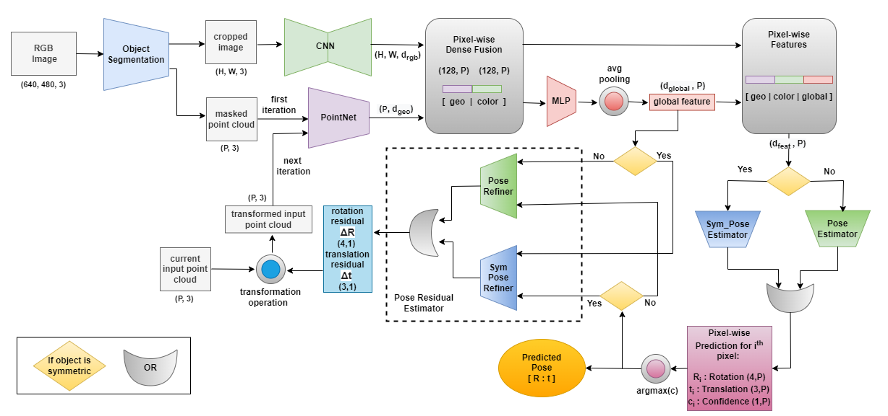
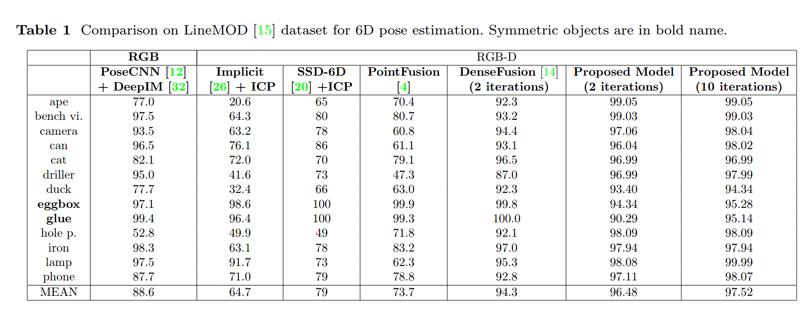

# Code for our paper <a href="https://arxiv.org/abs/2212.05560"> "Context-aware 6D Pose Estimation of Known Objects using RGB-D data" </a>
### 

### 

# Overview
In our work we proposed a  hybrid architecture that is context-aware. The proposed architecture treats the objects separately according to their types i.e; symmetric and
non-symmetri for 6D pose estimation. 
</br>

### Overview of the proposed architecture:
<p align="center">
  
</p>
</br>


## Datasets

This work is tested on Linemod datasets:


* [LineMOD](http://campar.in.tum.de/Main/StefanHinterstoisser): Download the [preprocessed LineMOD dataset](https://drive.google.com/drive/folders/19ivHpaKm9dOrr12fzC8IDFczWRPFxho7) (including the testing results outputted by the trained vanilla SegNet used for evaluation).

Download preprocessed LineMOD dataset:
```	
./download.sh
```
## Training 

* LineMOD Dataset:
	After you have downloaded and unzipped the Linemod_preprocessed.zip, please run:
```	
./experiments/scripts/train_linemod.sh
```


## Evaluation on LineMOD Dataset

Just run:
```
./experiments/scripts/eval_linemod.sh
```
This script will test the models on the testing set of the LineMOD dataset with the masks outputted by the trained vanilla SegNet model. The result will be printed at the end of the execution and saved as a log in `experiments/eval_result/linemod/`.


## Results

* LineMOD Dataset:

Quantitative evaluation result with ADD metric for non-symmetry objects and ADD-S for symmetry objects(eggbox, glue) compared to other RGB-D methods. High performance RGB methods are also listed for reference.

<p align="center">
	
</p>

The qualitative result on the Linemod dataset.

<p align="center">
	
</p>


# Citation

```

```

